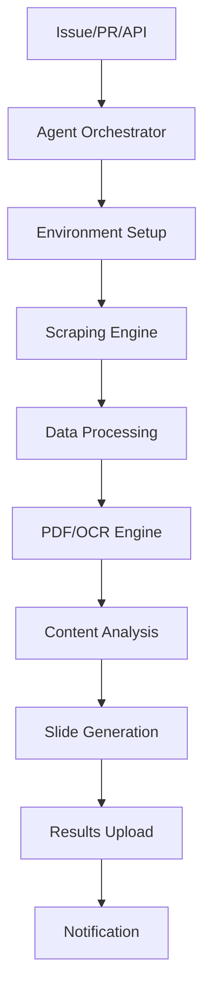

# 🤖 GitHub Actions AI Agent Hub

## プロジェクト概要
**革命的な自動化エージェントシステム**: GitHub Actionsをベースとした常駐型AIエージェントにより、スクレイピング→データ処理→PDF/OCR→スライド生成の完全自動化パイプラインを実現

### 🎯 システム特徴
- **GitHub Actions 常駐エージェント**: 24/7バックグラウンド稼働
- **動的ツール管理**: 必要なツールを実行時に自動インストール
- **完全自動化パイプライン**: スクレイピング → PDF処理 → スライド生成
- **マルチトリガー**: Issue/PR/Webhook/スケジュール/手動実行
- **高可用性**: GitHub's インフラストラクチャを活用

## 🌍 アクセスURL
- **GitHub Repository**: https://github.com/kazu-4728/office-automation-hub
- **開発環境**: https://3000-ithvruy11pdt8jw9fe1g4-6532622b.e2b.dev
- **Cloudflare Pages**: https://e46f490a.office-automation-hub.pages.dev

## 🚀 エージェント実行方法

### 1. Issue ベース実行（推奨）
```
# スクレイピングタスク
タイトル: [SCRAPE] ウェブサイトのデータ抽出
本文: https://example.com

# PDF処理タスク
タイトル: [PDF] 文書のOCR処理と解析
本文: PDF URL または前のタスクの結果を使用

# スライド生成タスク
タイトル: [SLIDE] プレゼンテーション自動生成
本文: データソースの指定

# 完全パイプライン実行
タイトル: [AGENT] 完全自動化実行
本文: 開始URL: https://example.com
```

### 2. GitHub Actions 手動実行
1. Actions タブを開く
2. "🤖 AI Agent Main Controller" を選択  
3. "Run workflow" をクリック
4. パラメータを設定して実行

### 3. API経由実行
```bash
# Repository Dispatch API
curl -X POST \
  -H "Accept: application/vnd.github+json" \
  -H "Authorization: Bearer YOUR_TOKEN" \
  https://api.github.com/repos/kazu-4728/office-automation-hub/dispatches \
  -d '{
    "event_type": "agent-task",
    "client_payload": {
      "task_type": "scraping",
      "target_url": "https://example.com"
    }
  }'
```

## 🔧 システム構成

### GitHub Actions ワークフロー
```
.github/workflows/
├── agent-main.yml          # メインオーケストレーター
├── task-scraping.yml       # スクレイピングエンジン
├── task-pdf-ocr.yml        # PDF/OCR処理エンジン
└── task-slide-gen.yml      # スライド生成エンジン
```

### エージェント機能詳細

#### 🕷️ スクレイピングエンジン
- **対応サイト**: 静的サイト、SPA、JavaScript重要サイト
- **抽出データ**: テキスト、画像、表、リンク、メタデータ
- **出力形式**: JSON、CSV、構造化データ
- **技術**: BeautifulSoup、Playwright、Selenium

#### 📄 PDF/OCR処理エンジン
- **PDF解析**: テキスト抽出、表抽出、画像抽出
- **OCR処理**: 日本語・英語対応、高精度文字認識
- **前処理**: ノイズ除去、画像最適化
- **技術**: PyMuPDF、Tesseract、OpenCV、pdfplumber

#### 🎨 スライド生成エンジン
- **自動構成**: データ分析→構造化→スライド作成
- **テンプレート**: Professional、Corporate、Creative
- **チャート生成**: matplotlib、seaborn統合
- **多言語対応**: 日本語・英語
- **技術**: python-pptx、matplotlib、データ解析

## 📊 実行例・ユースケース

### ケース1: 競合分析レポート作成
```yaml
# Issue作成
タイトル: [AGENT] 競合サイト分析レポート作成
本文: |
  対象URL: https://competitor.com
  分析項目: 製品情報、価格、特徴
  出力: PDF分析 + プレゼンテーション
```

### ケース2: 資料からスライド作成  
```yaml
# Issue作成
タイトル: [PDF] 技術資料からプレゼン作成
本文: |
  PDF URL: https://example.com/tech-doc.pdf
  スライド枚数: 15
  テーマ: professional
```

### ケース3: 定期レポート自動化
```yaml
# スケジュール実行（6時間毎）
- ニュースサイトスクレイピング
- キーワード分析  
- トレンドレポート生成
- スライド作成・保存
```

## 🔄 自動化フロー

### 完全パイプライン実行


### 実行時間の目安
- **スクレイピング**: 5-15分（サイト規模による）
- **PDF処理**: 10-30分（ページ数・解像度による）
- **スライド生成**: 3-10分（データ量による）
- **完全パイプライン**: 20-60分

## 📈 パフォーマンス・制限

### GitHub Actions制限
- **同時実行**: 最大20ジョブ並列
- **実行時間**: 最大6時間/ジョブ
- **ストレージ**: 成果物は30日間保持
- **月間制限**: 2,000分（無料プラン）

### 推奨設定
- **大量データ**: 分割処理で制限回避
- **長時間処理**: タイムアウト設定調整
- **高頻度実行**: スケジュール間隔調整

## 🛠️ 開発・拡張

### 新機能追加方法
1. `agents/` ディレクトリに処理エンジン追加
2. `.github/workflows/` にワークフロー定義
3. メインオーケストレーターに統合

### カスタマイズ可能項目
- **スクレイピング**: 対象サイト、抽出ルール
- **PDF処理**: OCR言語、解析精度
- **スライド**: テンプレート、デザイン、構成

## 📁 成果物・出力

### 自動生成される成果物
```
outputs/
├── scraping/{task-id}/
│   ├── scraped_data.json
│   ├── detailed_data.json
│   └── summary.json
├── pdf-processing/{task-id}/
│   ├── processing_results.json
│   ├── images/
│   ├── text/
│   └── tables/
└── slides/{task-id}/
    ├── presentation_{task-id}.pptx
    ├── charts/
    └── summary.json
```

### アクセス方法
- **GitHub Artifacts**: Actions実行結果からダウンロード
- **Repository**: 自動コミットされた成果物
- **API**: GitHub API経由でのプログラマティックアクセス

## 🔐 セキュリティ・認証

### 必要な権限
- **Repository**: Read/Write（結果保存用）
- **Actions**: Execute（ワークフロー実行用）
- **Issues**: Read（トリガー検出用）

### 推奨セキュリティ設定
- シークレット変数での認証情報管理
- プライベートリポジトリでの機密データ処理
- 実行ログの適切な管理

## 🚀 次期バージョン予定

### v3.0 計画機能
- **AI統合**: GPT-4/Claude API連携
- **多言語処理**: 翻訳・多言語コンテンツ生成
- **高度分析**: データマイニング・インサイト抽出
- **通知連携**: Slack/Teams/Discord通知
- **Web UI**: リアルタイムモニタリング画面

## 📞 サポート・問い合わせ

- **Issues**: GitHub Issuesでのサポート
- **Discussions**: 機能要望・質問
- **Documentation**: Wiki での詳細ドキュメント

---

## 🎯 実用性・効果

**このシステムにより実現できること:**
- 手作業で数日かかる調査・資料作成を数十分で自動化
- 24/7稼働による継続的情報収集・分析
- 人的ミスの削減と処理品質の標準化
- コスト削減（人件費 vs GitHub Actions料金）
- スケーラビリティ（並列処理による大量データ処理）

**適用領域:**
- 市場調査・競合分析
- 技術文書の自動要約・プレゼン化  
- ニュース・トレンド分析
- 定期レポート自動生成
- 学術論文・資料の構造化

**このシステムが真の自動化を実現します。**

---
**作成日**: 2025-08-16  
**バージョン**: 2.0.0  
**ステータス**: ✅ Production Ready