# 🏗️ 設計フロー：EZ Manual Simplifier

**プロジェクト名**: EZ Manual Simplifier  
**作成日**: 2025-10-04  
**バージョン**: 1.0  
**参照**: `requirements.md`

---

## 📐 1. システムアーキテクチャ

### 1.1 全体構成図（Mermaid）

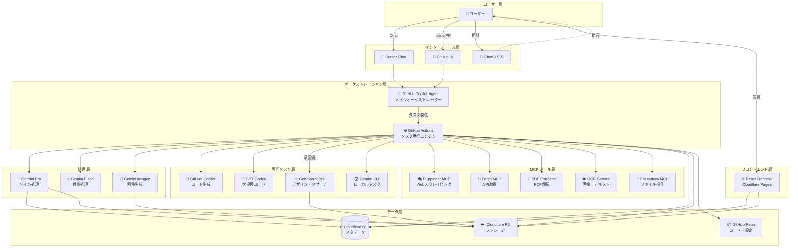

### 1.2 レイヤー説明

| レイヤー | 責務 | 技術 |
|---------|------|------|
| **ユーザー層** | 指示出し、結果確認 | 人間 |
| **インターフェース層** | ユーザー入力の受付 | Cursor、GitHub、ChatGPT |
| **オーケストレーション層** | タスク分解・分配・管理 | Copilot Agent、GitHub Actions |
| **処理層** | コンテンツ変換・生成 | Gemini Pro/Flash/Imagen |
| **専門タスク層** | 特殊タスク実行 | Copilot、Codex、Gen Spark、Gemini CLI |
| **MCPツール層** | 外部データ取得・操作 | 各種MCPサーバー |
| **データ層** | 永続化、バージョン管理 | D1、R2、GitHub |
| **フロントエンド層** | UI提供 | React、Cloudflare Pages |

---

## 🔄 2. データフロー

### 2.1 メインフロー：マニュアル変換

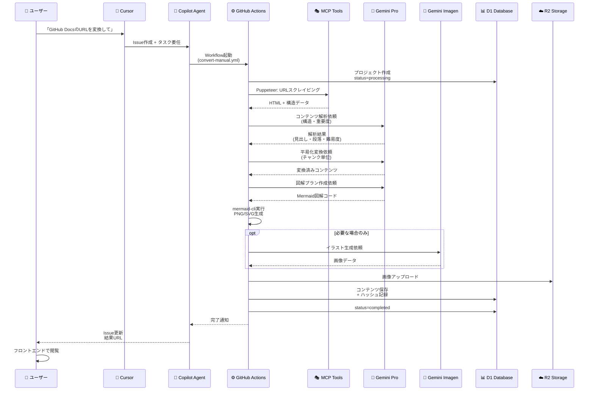

### 2.2 承認フロー：Gen Spark使用時

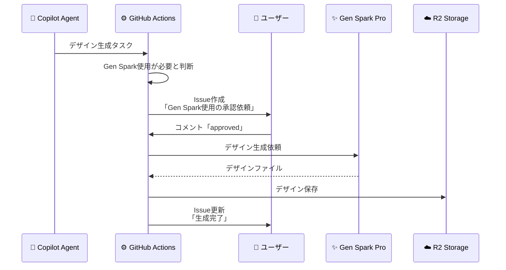

---

## 🔀 3. エージェント連携フロー

### 3.1 エージェント役割マトリクス

| エージェント | GitHub直接 | Cloudflare | API | ローカル | コスト | 主要役割 |
|------------|----------|------------|-----|---------|--------|---------|
| **Copilot Agent** | ✅ | ❌ | ✅ | ❌ | $10/月 | オーケストレーション |
| **GitHub Actions** | ✅ | ✅ | ✅ | ❌ | $0 | タスク実行 |
| **Gemini Pro** | ❌ | ❌ | ✅ | ❌ | $20/月 | メイン処理 |
| **Gemini Flash** | ❌ | ❌ | ✅ | ❌ | $0 | 軽量処理 |
| **Gemini Imagen** | ❌ | ❌ | ✅ | ❌ | $0 | 画像生成 |
| **GitHub Copilot** | ✅ | ❌ | ✅ | ❌ | $10/月 | コード生成 |
| **GPT Codex** | ✅ | ❌ | ✅ | ❌ | 従量 | 大規模コード |
| **Gen Spark Pro** | ✅ | ✅ | ✅ | ❌ | $?/月 | デザイン・リサーチ（承認制） |
| **Gemini CLI** | ❌ | ❌ | ✅ | ✅ | $0 | ローカルタスク |

### 3.2 タスク種別ごとの担当エージェント

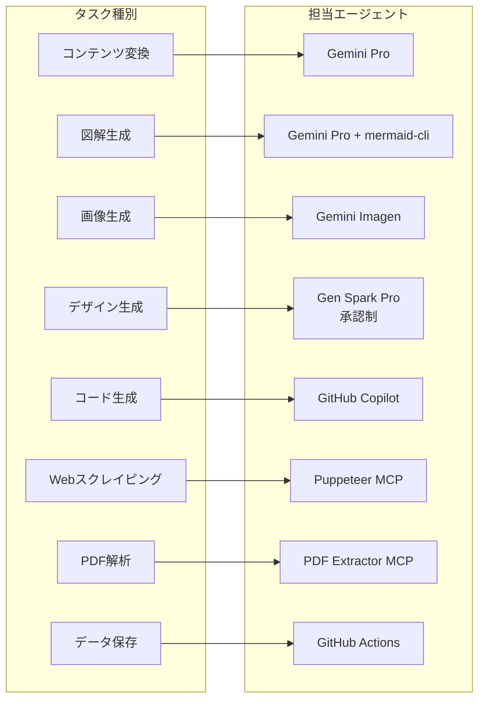

### 3.3 意思決定フロー

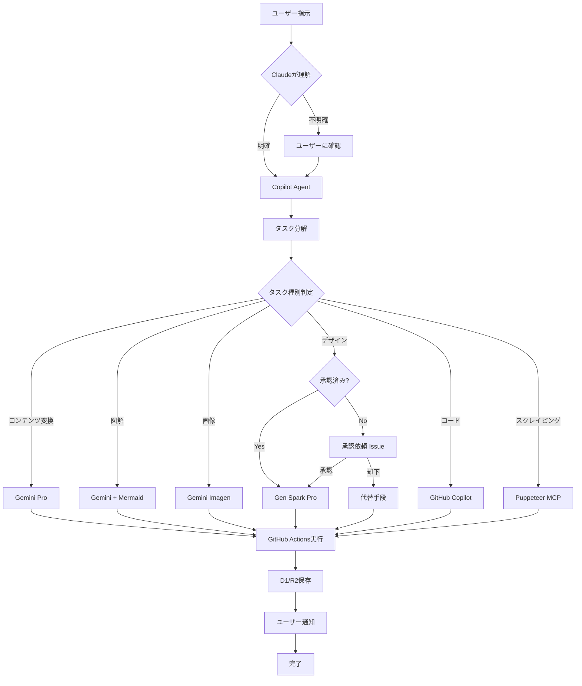

---

## 🗂️ 4. ディレクトリ構成

### 4.1 プロジェクト構造

```
ez-manual/
├── .github/
│   ├── workflows/                    # GitHub Actions
│   │   ├── convert-manual.yml        # メインワークフロー
│   │   ├── deploy-frontend.yml       # フロントエンドデプロイ
│   │   ├── test.yml                  # テスト実行
│   │   └── orchestrator.yml          # オーケストレーター
│   ├── scripts/                      # ヘルパースクリプト
│   │   ├── setup_database.sql        # D1スキーマ
│   │   └── deploy.sh                 # デプロイスクリプト
│   └── ISSUE_TEMPLATE/               # Issueテンプレート
│       ├── conversion-request.md
│       └── genspark-approval.md
│
├── .mcp/                             # MCP設定
│   └── config.json
│
├── docs/                             # ドキュメント
│   ├── requirements.md               # ✅ 要件定義
│   ├── design-flow.md                # ✅ 設計フロー
│   ├── task-checklist.md             # ✅ タスクチェックリスト
│   ├── api-reference.md              # API仕様
│   └── deployment-guide.md           # デプロイ手順
│
├── shared/                           # 共通型定義
│   └── types/
│       ├── project.ts
│       ├── document.ts
│       ├── agent.ts
│       └── index.ts
│
├── frontend/                         # フロントエンド
│   ├── public/
│   ├── src/
│   │   ├── components/               # UIコンポーネント
│   │   ├── pages/                    # ページ
│   │   ├── hooks/                    # カスタムフック
│   │   ├── store/                    # 状態管理（Zustand）
│   │   ├── api/                      # API クライアント
│   │   └── main.tsx
│   ├── index.html
│   └── vite.config.ts
│
├── backend/                          # バックエンド（Workers）
│   ├── src/
│   │   ├── index.ts                  # メインエントリ
│   │   ├── routes/                   # APIルート
│   │   ├── services/                 # ビジネスロジック
│   │   ├── db/                       # D1操作
│   │   └── utils/                    # ユーティリティ
│   └── wrangler.toml
│
├── agents/                           # エージェントスクリプト
│   ├── gemini/
│   │   ├── content-converter.ts      # コンテンツ変換
│   │   ├── diagram-generator.ts      # 図解生成
│   │   └── image-generator.ts        # 画像生成
│   ├── mcp/
│   │   ├── puppeteer-client.ts       # Puppeteer MCP
│   │   ├── pdf-client.ts             # PDF MCP
│   │   └── ocr-client.ts             # OCR MCP
│   └── orchestrator/
│       └── task-distributor.ts       # タスク分配
│
├── prompts/                          # プロンプトテンプレート
│   ├── v1.0/                         # バージョン管理
│   │   ├── simplify-content.txt
│   │   ├── generate-diagram.txt
│   │   └── analyze-structure.txt
│   └── README.md
│
├── tests/                            # テスト
│   ├── unit/
│   ├── integration/
│   └── e2e/
│
├── .cursorrules                      # Cursor設定
├── .env.example                      # 環境変数テンプレート
├── .gitignore
├── package.json
├── tsconfig.json
├── tailwind.config.js
└── README.md
```

### 4.2 出力ディレクトリ構成

```
output/
├── projects/
│   └── {project-id}/                 # プロジェクトごと
│       ├── metadata.json             # メタデータ
│       ├── original/                 # 元データ
│       │   └── content.md
│       ├── converted/                # 変換後
│       │   ├── index.html
│       │   ├── page-1.html
│       │   └── ...
│       ├── images/                   # 生成画像
│       │   ├── diagrams/
│       │   │   ├── flow-1.svg
│       │   │   └── ...
│       │   └── illustrations/
│       │       ├── concept-1.png
│       │       └── ...
│       └── versions/                 # バージョン履歴
│           ├── v1/
│           ├── v2/
│           └── ...
```

---

## 🔐 5. セキュリティ設計

### 5.1 APIキー管理

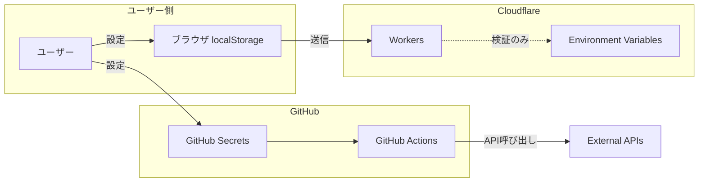

### 5.2 セキュリティレイヤー

| レイヤー | 対策 | 実装 |
|---------|------|------|
| **入力検証** | XSS、インジェクション対策 | Zod、DOMPurify |
| **認証** | APIキー検証 | Custom middleware |
| **認可** | レート制限 | Cloudflare Rate Limiting |
| **通信** | HTTPS強制 | Cloudflare SSL |
| **データ** | 暗号化保存（必要時） | Cloudflare KV encryption |

---

## 📈 6. スケーラビリティ設計

### 6.1 並列処理戦略

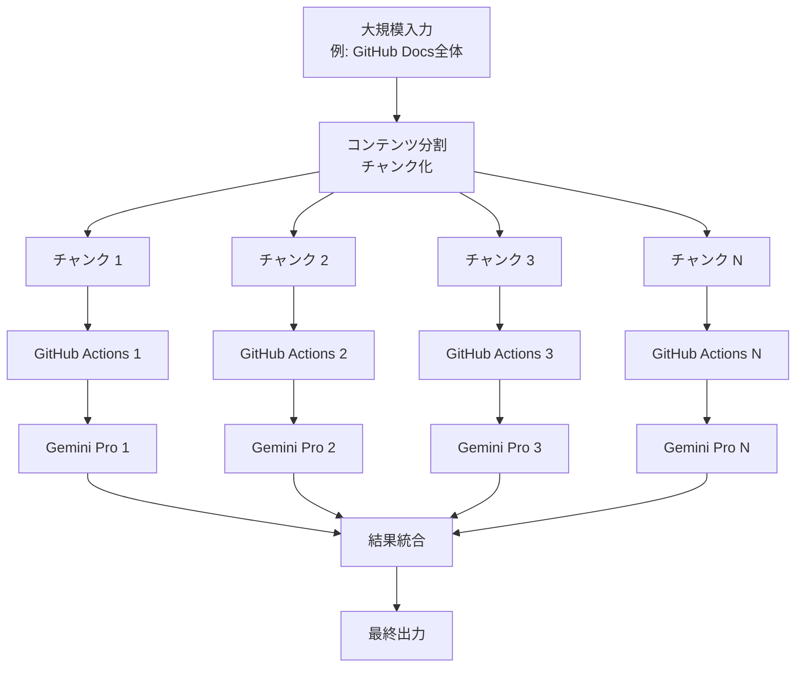

### 6.2 キャッシング戦略

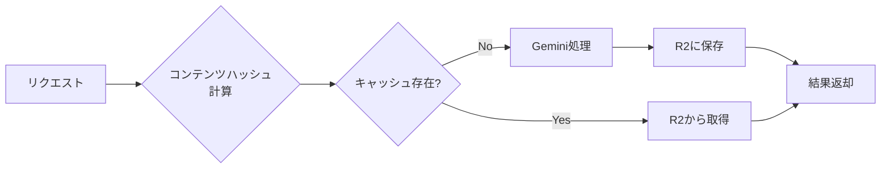

---

## 🔄 7. バージョン管理・再現性設計

### 7.1 再現性確保の仕組み

```yaml
reproducibility_strategy:
  
  input_hash:
    method: SHA-256
    input:
      - 元コンテンツ
      - 変換設定
      - プロンプトバージョン
    output: 決定的ハッシュ
  
  prompt_versioning:
    storage: Git（prompts/v1.0/）
    format: |
      # v1.0 - 2025-10-04
      ## simplify-content.txt
      あなたは...
    
    tracking: |
      versions テーブルに記録
      prompt_version: "v1.0"
  
  model_versioning:
    tracking: |
      使用モデル記録
      model_version: "gemini-1.5-pro-002"
  
  parameters_tracking:
    storage: D1 versions テーブル
    format: JSON
    example:
      temperature: 0.7
      max_tokens: 4096
      target_level: "elementary"
```

### 7.2 バージョン管理フロー

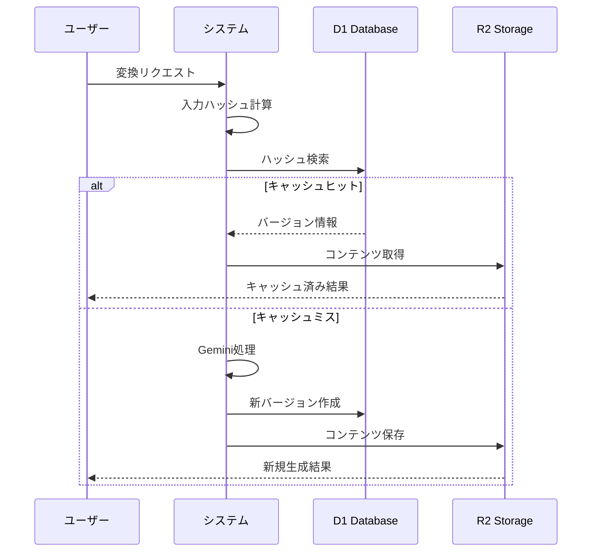

---

## 🚀 8. デプロイメント設計

### 8.1 デプロイフロー

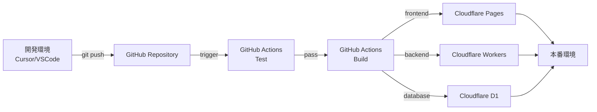

### 8.2 環境構成

| 環境 | ブランチ | デプロイ先 | 用途 |
|------|---------|-----------|------|
| **開発** | feature/* | ローカル | 機能開発 |
| **ステージング** | develop | Cloudflare Preview | 統合テスト |
| **本番** | main | Cloudflare Production | 本番運用 |

---

## 📊 9. モニタリング・ロギング設計

### 9.1 ログ収集フロー

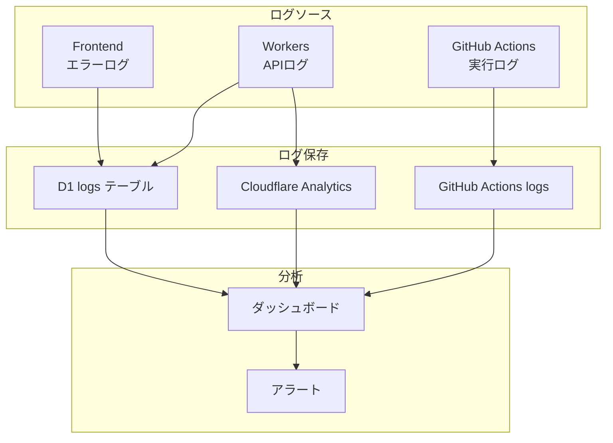

### 9.2 メトリクス

| カテゴリ | メトリクス | 目標値 |
|---------|-----------|--------|
| **パフォーマンス** | 変換時間 | < 5分（中規模） |
| **成功率** | 変換成功率 | > 95% |
| **コスト** | API使用量 | < $10/月 |
| **品質** | ユーザー評価 | > 4.0/5.0 |

---

## ✅ 10. 次ステップ

1. ✅ この設計フローの承認
2. ⏭️ タスクチェックリスト作成
3. ⏭️ プロジェクト初期化
4. ⏭️ GitHub Actions基本構成
5. ⏭️ Gemini Pro統合

---

**この設計フローに対するフィードバックをお願いします。**  
**修正・追加が必要な箇所があればお知らせください。**
